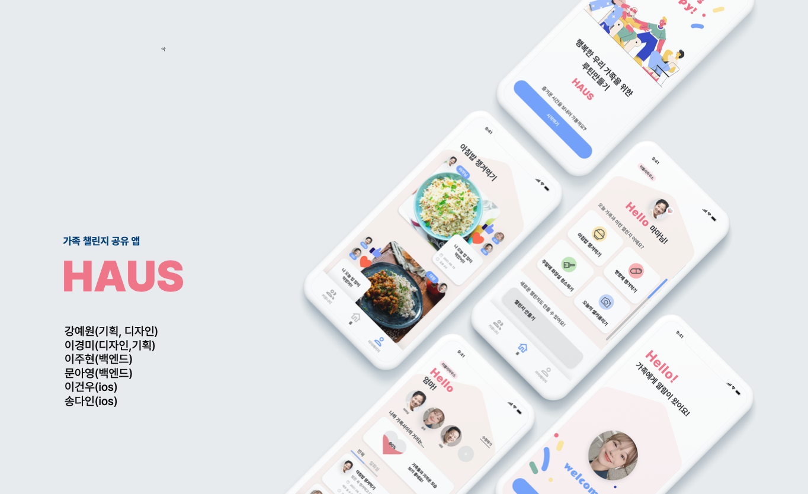

# [두굿해커톤 2조](https://event-us.kr/VQSsCeuiDpW2/event/33708) 

## 🎯 HAUS 서비스 소개
- HAUS, 가족 챌린지 공유 앱
- 멀리 떨어져있는 가족들의 심리적거리를 좁힐 수 있게 도와주는 서비스

  

 

## 📝 Framework / Library
- iOS, Swift, UIKit
- RxSwift, RxCocoa, RxAlamofire

 

## 📆 해커톤 기간
- 2021.08.13 ~ 2021.08.15

 

## 👨‍👨‍👦‍👦 해커톤 참여 인원(총 6명)
- 디자이너 & 기획
    - [`이경미`]
    - [`강예원`](https://github.com/dolylupec)
- 앱 개발(ios)
    - [`이건우`](https://github.com/lgvv)
    - [`송다인`](https://github.com/songda515)
- 백엔드 개발(Spring)
    - [`문아영`](https://github.com/orgs/DoGood-Hackathon-2/people/ayoung0073)
    - [`이주현`](https://github.com/JuHyun419)
    
